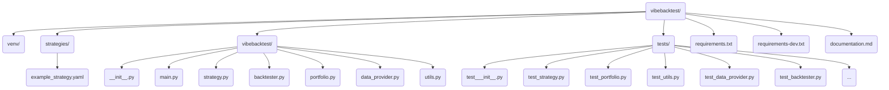

# VibeBackTest - Developer Documentation

## 1. Detailed Description of Application

**VibeBackTest** is a command-line interface (CLI) application built in Python. Its primary purpose is to backtest investment strategies based on historical market data. Users define their investment strategy in a YAML configuration file, specifying parameters like starting capital, monthly additions, asset screening criteria, and portfolio rebalancing rules.

The application takes this strategy file, along with a start and end date (Year/Month format), as input. It then simulates the execution of this strategy over the specified period, month by month.

**Core Workflow:**

1.  **Validation:** Before starting the backtest, the application validates the inputs:
    *   Ensures the start date is chronologically before the end date.
    *   Checks if the backtest duration is at least one full year.
    *   Verifies that the specified strategy YAML file exists and is well-formed according to the expected structure.
2.  **Monthly Backtesting Loop:** The application iterates month by month from the start date to the end date. In each monthly cycle, it performs the following steps:
    *   **Screener:** Uses the criteria defined in the strategy YAML to screen for assets (e.g., stocks, ETFs) using data retrieved via the `openbb` library. It selects a predefined number of top-ranking assets based on the strategy.
    *   **Transactions:** Simulates portfolio adjustments based on the screener results and rebalancing rules:
        *   Identifies assets currently held in the portfolio but *not* selected by the screener for the current month – these are marked for selling.
        *   Identifies assets selected by the screener but *not* currently in the portfolio – these are marked for buying.
        *   Calculates buy/sell orders based on the rebalancing rules (e.g., allocate capital equally among selected assets).
        *   Simulates the execution of these buy/sell transactions.
    *   **Calculation:** After transactions, it calculates:
        *   The total current market value of the portfolio based on the prices of held assets at the end of the month.
        *   The total amount of money invested so far (initial capital + all monthly additions up to that point).
    *   **Storing:** Records the state for the current month:
        *   List of assets held in the portfolio and their quantities.
        *   Details of buy/sell transactions executed.
        *   Calculated portfolio value.
        *   Total invested amount.
        *(Note: For this initial version, storing might happen in memory during the run, with only the final results being displayed. More persistent storage could be added later).*
3.  **Results Presentation:** Once the loop completes (reaches the end date), the application displays a summary of the backtest results:
    *   The assets held in the portfolio in the final month.
    *   The final calculated portfolio value.
    *   The total amount of money invested over the entire period.

The application relies heavily on the `openbb` library for accessing historical financial data, screening assets, and potentially fetching price information needed for calculations and transaction simulation.

## 2. List of Steps to Accomplish the Target (Build the App)

Here’s a suggested sequence of steps for developing the `VibeBackTest` application:

1.  **Setup Project Environment:**
    *   Create a project directory (e.g., `vibebacktest`).
    *   Set up a Python virtual environment (e.g., `python -m venv venv`).
    *   Activate the virtual environment (`source venv/bin/activate` on Linux/macOS or `.\venv\Scripts\activate` on Windows).
    *   Install necessary libraries: `pip install openbb pyyaml python-dateutil` (We'll use `python-dateutil` for easier month increments). Create a `requirements.txt` file. *(Note: `openbb` installs the Python SDK, which is used for programmatic access within the script).*

2.  **Implement Command-Line Argument Parsing:**
    *   Use the `argparse` module (standard library).
    *   Define arguments for:
        *   `--strategy` (path to the strategy YAML file, required).
        *   `--start-date` (start date in 'YYYY-MM' format, required).
        *   `--end-date` (end date in 'YYYY-MM' format, required).

3.  **Implement Strategy Loading and Validation (Phase 1):**
    *   Create functions or a class to handle the strategy file.
    *   Use `PyYAML` to load the YAML file specified by the `--strategy` argument.
    *   Implement validation logic:
        *   Check if the file exists.
        *   Use `try...except` block during YAML parsing to catch formatting errors.
        *   Validate the presence and basic types of required keys (e.g., `initial_capital`, `monthly_addition`, `rebalancing`, `screener`).
        *   Parse `--start-date` and `--end-date` into `datetime` objects.
        *   Validate the date logic (start < end, period >= 1 year). Handle potential `ValueError` during date parsing.

4.  **Design and Implement Data Structures:**
    *   Decide how to represent the portfolio (e.g., a dictionary like `{'AAPL': {'quantity': 10}, 'MSFT': {'quantity': 5}}`).
    *   Decide how to store cash available.
    *   Decide how to store historical data collected during the backtest (e.g., a list of dictionaries, where each dictionary represents a month's state).

5.  **Implement Core Backtesting Logic (Phase 2):**
*   This phase heavily utilizes the OpenBB SDK (typically imported as `obb`) for accessing market data. Ensure proper installation and potentially API key configuration for the desired data providers (e.g., FMP, Polygon, yfinance).
    *   Create the main backtesting loop that iterates month by month from the start date to the end date. Use `dateutil.relativedelta.relativedelta(months=1)` for easy increments.
    *   **Inside the loop:**
        *   **a. Screener:**
            *   Translate the criteria defined in the `screener` section of the strategy YAML file into parameters for the OpenBB SDK.
            *   The primary function for this is likely `obb.equity.screener`. You'll need to map the YAML `metric`, `min`, `max`, and `ranking` fields to the corresponding parameters of this function for a chosen provider (e.g., `fmp`, `nasdaq`). Refer to the OpenBB SDK documentation for the exact parameter names and supported metrics for each provider.
            *   Example using `obb.equity.screener` (conceptual, provider parameters may vary):
                ```python
                import openbb as obb
                import logging
                import pandas as pd

                # Assume strategy_data is loaded from YAML
                strategy_data = {
                    'screener': {
                        'criteria': [
                            {'metric': 'MarketCap', 'min': 2000000000, 'max': 200000000000},
                            {'metric': 'P/E', 'max': 25},
                            {'metric': 'AverageVolume', 'min': 1000000}
                        ],
                        'ranking': {'metric': 'MarketCap', 'order': 'descending'}
                    },
                    'rebalancing': {'max_assets': 10}
                } # Example data

                screener_config = strategy_data.get('screener', {})
                criteria = screener_config.get('criteria', [])
                ranking = screener_config.get('ranking', {})
                max_assets = strategy_data.get('rebalancing', {}).get('max_assets', 10)

                # Example: Mapping YAML criteria to FMP provider parameters (adjust as needed)
                fmp_params = {
                    "mktcap_min": next((c.get('min') for c in criteria if c.get('metric') == 'MarketCap'), None),
                    "mktcap_max": next((c.get('max') for c in criteria if c.get('metric') == 'MarketCap'), None),
                    "pe_max": next((c.get('max') for c in criteria if c.get('metric') == 'P/E'), None),
                    "volume_min": next((c.get('min') for c in criteria if c.get('metric') == 'AverageVolume'), None),
                    "limit": max_assets * 5 # Fetch more initially for potential ranking/filtering
                    # Add other criteria mappings...
                }
                # Remove None values
                fmp_params = {k: v for k, v in fmp_params.items() if v is not None}

                selected_symbols = []
                try:
                    logging.info(f"Running screener with FMP params: {fmp_params}")
                    # Note: Ranking might need to be applied after fetching if not directly supported by API call
                    screener_results = obb.equity.screener(provider="fmp", **fmp_params)

                    if screener_results and screener_results.results:
                         # Convert results to DataFrame if it's not already
                         if isinstance(screener_results.results, list) and screener_results.results:
                             # Attempt to create DataFrame from list of Pydantic models or dicts
                             try:
                                 df = pd.DataFrame([r.model_dump() if hasattr(r, 'model_dump') else r for r in screener_results.results])
                             except Exception as df_err:
                                 logging.error(f"Could not convert screener results to DataFrame: {df_err}")
                                 df = pd.DataFrame() # Fallback to empty DF
                         elif isinstance(screener_results.results, pd.DataFrame):
                             df = screener_results.results
                         else:
                             df = pd.DataFrame() # Fallback

                         if not df.empty:
                             # Apply ranking defined in YAML (e.g., sort by market cap descending)
                             # Adjust metric name mapping if needed (e.g., YAML 'MarketCap' -> FMP 'marketCap')
                             rank_metric_yaml = ranking.get('metric', 'MarketCap')
                             # Simple mapping example (needs refinement based on actual FMP column names)
                             rank_metric_fmp = next((col for col in df.columns if col.lower() == rank_metric_yaml.lower()), None)

                             rank_order_asc = ranking.get('order', 'descending') != 'descending'

                             if rank_metric_fmp:
                                  df_ranked = df.sort_values(by=rank_metric_fmp, ascending=rank_order_asc)
                             else:
                                  logging.warning(f"Ranking metric '{rank_metric_yaml}' (mapped to '{rank_metric_fmp}') not found in FMP results columns: {df.columns}. Skipping ranking.")
                                  df_ranked = df

                             # Select top N assets
                             selected_symbols = df_ranked.head(max_assets)['symbol'].tolist()
                             logging.info(f"Selected {len(selected_symbols)} symbols after screening and ranking: {selected_symbols}")
                         else:
                             logging.warning("Screener returned results but DataFrame conversion failed or was empty.")
                    else:
                         logging.warning("Screener did not return any results.")

                except Exception as e:
                    logging.error(f"Error running screener: {e}")
                    # selected_symbols remains empty list

                # `selected_symbols` now holds the list of assets for this month
                ```
            *   Alternatively, for simpler lookups (like finding a specific ticker based on a query), `obb.equity.search` can be used. See the example `get_stock_suggestions` function provided earlier for usage.
            *   The goal is to obtain a list of asset symbols (`selected_symbols` in the example) that meet the strategy's criteria for the current month.
        *   **b. Transactions:**
            *   Determine which assets to sell (in portfolio but not in current screener list).
            *   Determine which assets to buy (in screener list but not in portfolio, or needing adjustment based on rebalancing).
            *   Implement the rebalancing logic (e.g., calculate target value per asset based on current portfolio value and `max_assets` for equal weighting).
            *   Simulate buys/sells: Adjust asset quantities in the portfolio data structure and update the available cash. To determine the transaction price, fetch the historical price data for the specific asset(s) on the transaction date(s) using `obb.equity.price.historical`.
            *   Example fetching daily price data for AAPL on a specific date:
                ```python
                import openbb as obb
                import logging
                import pandas as pd
                from datetime import date

                transaction_date = date(2023, 5, 15) # Example date
                symbol = "AAPL"
                price_data = None

                try:
                    # Fetch data for a small range around the date to ensure availability
                    start_fetch = transaction_date - pd.Timedelta(days=3)
                    end_fetch = transaction_date
                    logging.info(f"Fetching price for {symbol} around {transaction_date}")
                    # Note: Using .to_dataframe() method to get pandas DataFrame
                    historical_data = obb.equity.price.historical(
                        symbol=symbol,
                        start_date=start_fetch.strftime('%Y-%m-%d'),
                        end_date=end_fetch.strftime('%Y-%m-%d'),
                        interval="1d",
                        provider="fmp" # Or another preferred provider
                    )
                    if historical_data and historical_data.results:
                         df = historical_data.to_dataframe()
                         if not df.empty:
                             # Get the price for the specific date (usually the close price)
                             # Ensure index is datetime
                             df.index = pd.to_datetime(df.index)
                             # Find the latest entry on or before the transaction date
                             price_on_date = df.loc[df.index <= pd.Timestamp(transaction_date)].iloc[-1]
                             price_data = price_on_date['close'] # Or 'open', 'high', 'low' as needed
                             logging.info(f"Price for {symbol} on {transaction_date}: {price_data}")
                         else:
                             logging.warning(f"No data frame found for {symbol} around {transaction_date}")
                    else:
                        logging.warning(f"OpenBB query returned no results for {symbol} around {transaction_date}")
                except Exception as e:
                    logging.error(f"Error fetching price for {symbol} on {transaction_date}: {e}")

                # Use price_data (if not None) for transaction simulation
                ```
        *   **c. Calculation:**
            *   Fetch end-of-month prices for all assets currently held in the portfolio using `obb.equity.price.historical`. This requires making a call for the relevant month's end date (or the last trading day of the month).
            *   Example fetching end-of-month closing prices for multiple held assets:
                ```python
                import openbb as obb
                import logging
                import pandas as pd
                from datetime import date

                # Assume current_month_end is the last day of the month being processed
                current_month_end = date(2023, 5, 31) # Example date
                held_symbols = ["AAPL", "MSFT", "GOOG"] # Example list of symbols held
                portfolio_value = 0.0
                asset_prices = {}

                if held_symbols:
                    try:
                        # Fetch data for the last few days of the month for all symbols
                        start_fetch = current_month_end - pd.Timedelta(days=5)
                        end_fetch = current_month_end
                        logging.info(f"Fetching end-of-month prices for {held_symbols} around {current_month_end}")
                        # Fetching for multiple symbols might return a dict or combined DataFrame
                        # Using .to_dataframe() method to get pandas DataFrame
                        historical_data = obb.equity.price.historical(
                            symbol=",".join(held_symbols), # Some providers take comma-separated string
                            # symbol=held_symbols, # Others might take a list
                            start_date=start_fetch.strftime('%Y-%m-%d'),
                            end_date=end_fetch.strftime('%Y-%m-%d'),
                            interval="1d",
                            provider="fmp" # Or another preferred provider
                        )

                        if historical_data and historical_data.results:
                            df_all = historical_data.to_dataframe()
                            if not df_all.empty:
                                # Process the combined DataFrame to get latest close for each symbol
                                df_all.index = pd.to_datetime(df_all.index)
                                # Filter data up to the month end date
                                df_filtered = df_all[df_all.index <= pd.Timestamp(current_month_end)]

                                if 'symbol' in df_filtered.columns: # Check if symbol column exists for multi-symbol results
                                     # Group by symbol and get the last entry for each
                                     latest_prices = df_filtered.groupby('symbol').last()
                                     asset_prices = latest_prices['close'].to_dict()
                                elif len(held_symbols) == 1 and not df_filtered.empty: # Handle single symbol case
                                     asset_prices[held_symbols[0]] = df_filtered.iloc[-1]['close']
                                else:
                                     logging.warning(f"Could not reliably extract prices for all symbols. Result format might differ. Check DataFrame: {df_filtered.head()}")
                                     # Fallback: could attempt fetch individually if needed

                                logging.info(f"End-of-month prices: {asset_prices}")
                            else:
                                 logging.warning(f"No data frame found for {held_symbols} around {current_month_end}")
                        else:
                            logging.warning(f"No price data returned for {held_symbols} around {current_month_end}")

                    except Exception as e:
                         logging.error(f"Error fetching end-of-month prices for {held_symbols}: {e}")

                # Use asset_prices (containing {'AAPL': price, 'MSFT': price, ...}) to calculate portfolio value
                # portfolio_value = sum(quantity * asset_prices.get(symbol, 0) for symbol, holding in portfolio.items()) + cash
                ```
            *   Calculate the total market value of the portfolio (sum of `quantity * price` for all assets) plus any remaining cash.
            *   Keep track of the total invested capital (initial + cumulative monthly additions).
        *   **d. Storing:**
            *   Append the relevant data for the current month (portfolio holdings, transactions list, portfolio value, invested capital) to your historical data structure.

6.  **Implement Results Presentation (Phase 3):**
    *   After the loop finishes, access the last entry in your historical data structure.
    *   Print the final portfolio holdings, the final portfolio value, and the total invested capital in a clear, readable format.

7.  **Add Error Handling and Logging:**
    *   Wrap `openbb` calls in `try...except` blocks to handle potential API errors or data availability issues.
    *   Add basic logging (`logging` module) to show progress (e.g., "Processing Month YYYY-MM...") and report errors.

8.  **Refine and Document Code:**
    *   Add comments and docstrings to your Python code.
    *   Refactor code for clarity and efficiency.
    *   Ensure the command-line interface is user-friendly.

## 3. Technologies and Libraries to be Used

*   **Language:** Python (Version 3.8 or higher recommended)
*   **Core Library:**
    *   `openbb`: For accessing financial market data, screening assets, and fetching historical prices. (Note: You might interact with its SDK components rather than the terminal itself).
*   **Configuration:**
    *   `PyYAML`: For parsing the strategy configuration files (`.yaml`).
*   **Date/Time Handling:**
    *   `datetime` (Python standard library): For basic date objects.
    *   `python-dateutil`: For easier date calculations, especially adding months (`relativedelta`).
*   **Command-Line Interface:**
    *   `argparse` (Python standard library): For parsing command-line arguments.
*   **Environment Management:**
    *   `venv` (Python standard library): Recommended for creating isolated Python environments.

## 4. Files to be Created

Here is a suggested file structure for the project. You can adapt this as the project grows.

```
vibebacktest/
│
├── venv/                     # Python virtual environment (created by `python -m venv venv`)
│
├── strategies/               # Directory to store strategy YAML files
│   └── example_strategy.yaml # Example strategy configuration
│
├── vibebacktest/             # Source code directory (could also be named `src`)
│   ├── __init__.py           # Makes the directory a Python package
│   ├── main.py               # Main script entry point, handles CLI args, orchestrates workflow
│   ├── strategy.py           # Functions/class for loading and validating strategy YAML
│   ├── backtester.py         # Core backtesting loop logic, screener, transactions, calculations
│   ├── portfolio.py          # Class/functions to manage portfolio state (holdings, cash)
│   ├── data_provider.py      # (Optional but recommended) Wraps openbb calls for fetching data/screening
│   └── utils.py              # Utility functions (e.g., date formatting, calculations)
│
├── requirements.txt          # Lists project dependencies (openbb-terminal, PyYAML, python-dateutil)
└── README.md                 # Project documentation (this file)
```

**File Descriptions:**

*   `strategies/example_strategy.yaml`: An example YAML file defining an investment strategy (see design below).
*   `vibebacktest/main.py`: The main executable script. Parses arguments (`argparse`), loads the strategy (`strategy.py`), initializes the portfolio (`portfolio.py`), runs the backtest loop (`backtester.py`), and presents the final results.
*   `vibebacktest/strategy.py`: Contains code to read the `.yaml` file using `PyYAML`, validate its structure and content, and make the strategy parameters easily accessible to the rest of the application.
*   `vibebacktest/backtester.py`: Holds the primary logic. Contains the monthly loop. It will call the screener function, the transaction simulation logic, and the portfolio calculation logic. It likely interacts with `portfolio.py` and `data_provider.py`.
*   `vibebacktest/portfolio.py`: Manages the state of the simulated portfolio. Includes functions or methods to add/remove assets, update quantities, manage cash, and calculate total invested capital.
*   `vibebacktest/data_provider.py`: (Optional) Abstract interface for getting data from `openbb`. This makes it easier to test other parts of the application without making live API calls and isolates the `openbb` dependency. Functions like `get_price(ticker, date)`, `screen_assets(criteria)` could go here.
*   `vibebacktest/utils.py`: Contains small, reusable helper functions used across different modules (e.g., date manipulation, financial calculations if needed).
*   `requirements.txt`: File listing dependencies for `pip install -r requirements.txt`. Content would be like:
    ```
    openbb
    PyYAML
    python-dateutil
    ```
*   `README.md`: This documentation file.

## 5. Testing Strategy

Ensuring the reliability and correctness of `VibeBackTest` requires a solid testing strategy. This section outlines the recommended approach.

### 5.1. Testing Framework and Tools

*   **Framework:** We recommend using **`pytest`** as the primary testing framework due to its flexibility, powerful features (like fixtures), and extensive plugin ecosystem.
*   **Mocking:** For isolating tests from external dependencies (like `openbb`), use **`pytest-mock`** (a convenient wrapper around Python's built-in `unittest.mock`).
*   **Coverage:** To measure how much of your code is executed by tests, use **`pytest-cov`**.

### 5.2. Development Dependencies

Testing tools are development dependencies and should be kept separate from the core application requirements. Create a `requirements-dev.txt` file in the project root:

```
# requirements-dev.txt
pytest
pytest-mock
pytest-cov
# Add other development/testing tools here (e.g., linters like flake8)
```

Install these dependencies using:
```bash
pip install -r requirements-dev.txt
```

### 5.3. Test Directory Structure

Organize tests in a top-level `tests/` directory. The structure within `tests/` should ideally mirror the `vibebacktest/` source directory to make tests easy to find.



### 5.4. Focus on Unit Tests

The primary focus should be on **unit tests**. These tests verify individual components (functions, methods, classes) in isolation.

*   **Benefits:** Easier to write and debug, faster execution, clearly identify the source of failures.

### 5.5. Mocking External Dependencies (`openbb`)

It is crucial to **mock** interactions with external services like the `openbb` library, especially within the `data_provider.py` module (if implemented) or wherever `openbb` functions are directly called.

*   **Why Mock?**
    *   **Isolation:** Tests shouldn't rely on external services being available or returning consistent data.
    *   **Speed:** Network calls are slow; mocks are instantaneous.
    *   **Predictability:** You control the exact data returned by the mock, making test outcomes deterministic.

*   **Conceptual Example (`pytest-mock`):**

    ```python
    # Example in tests/test_data_provider.py (Conceptual)
    from vibebacktest import data_provider # Assuming this exists

    def test_get_price_mocking(mocker):
        # Arrange: Mock the underlying openbb function called by data_provider.get_price
        # The exact target string depends on how openbb is imported and used.
        mock_openbb_price = mocker.patch('openbb_sdk.openbb.stocks.load', return_value=150.50) # Example target and return

        # Act: Call your data provider function
        price = data_provider.get_price('AAPL', '2023-10-26')

        # Assert: Check the result and that the mock was used
        assert price == 150.50
        mock_openbb_price.assert_called_once_with(symbol='AAPL', start_date='2023-10-26', end_date='2023-10-26') # Verify call args
    ```

### 5.6. Test Structure (Arrange-Act-Assert)

Structure your tests using the **Arrange-Act-Assert (AAA)** pattern:

1.  **Arrange:** Set up the test prerequisites (create objects, prepare mock data, configure mocks).
2.  **Act:** Execute the code being tested.
3.  **Assert:** Verify that the outcome of the action matches the expected result.

### 5.7. Running Tests

Execute tests from the project root directory:

*   **Run all tests:**
    ```bash
    pytest
    ```
*   **Run tests with coverage report:**
    ```bash
    pytest --cov=vibebacktest tests/
    ```
    This command tells `pytest-cov` to measure coverage for the `vibebacktest` package while running tests found in the `tests/` directory. A report will be printed to the console.

### 5.8. Test Coverage

Aim for good test coverage, ensuring that critical logic, validation rules, and calculations are tested. While striving for high coverage is beneficial, focus on testing important functionalities and edge cases first. Use the coverage reports generated by `pytest-cov` to identify untested areas of the code. All new code changes and features should be accompanied by corresponding tests.

### 5.9. What to Test (Examples)

*   **`strategy.py`:** Loading valid/invalid YAML, date parsing, date logic validation.
*   **`portfolio.py`:** Correct calculation of portfolio value, cash updates after transactions, adding/removing assets.
*   **`backtester.py`:** Core loop logic (using mocked data), handling of screener results, rebalancing logic, transaction execution logic.
*   **`data_provider.py`:** Correct interaction with mocked `openbb` functions, handling of simulated API responses.
*   **`utils.py`:** Any helper functions for calculations or data manipulation.
*   **`main.py`:** Command-line argument parsing logic.

---
---

## Strategy YAML File Design and Example

The strategy configuration file drives the backtesting process. Here's a proposed structure:

```yaml
# --- VibeBackTest Strategy Configuration ---

# Initial amount of cash to start the backtest with.
initial_capital: 10000.00

# Amount of new cash added to the portfolio at the beginning of each month.
# Set to 0 if no new money is added regularly.
monthly_addition: 500.00

# --- Rebalancing Rules ---
rebalancing:
  # How often to run the screener and rebalance the portfolio.
  # For now, only "monthly" is supported due to the core loop structure.
  frequency: monthly

  # How to allocate capital among the selected assets.
  # "equal": Divide capital equally among the selected assets.
  # Future options could include "market_cap", "custom_weights", etc.
  weighting: equal

  # The target number of assets to hold after rebalancing.
  # The screener will find potentially many assets, but the portfolio
  # will be adjusted to hold only this number of top-ranked ones.
  max_assets: 10

# --- Asset Screener Configuration ---
# Defines the criteria used to select assets each month.
# This needs to map closely to the capabilities of the openbb screener function.
screener:
  # Type of asset to screen for (e.g., 'equity', 'etf', 'crypto')
  # This should align with openbb preset/filter options.
  asset_type: equity

  # Define screening criteria. This is an example structure.
  # The exact 'metric' names must match what openbb's screener expects.
  # Explore openbb documentation for available screening metrics.
  criteria:
    # Example 1: Market Capitalization between $2B and $200B
    - metric: MarketCap
      min: 2000000000 # $2 Billion
      max: 200000000000 # $200 Billion
    # Example 2: Price-to-Earnings (P/E) ratio below 25
    - metric: P/E
      min: 0 # Optional: minimum P/E (e.g., must be positive)
      max: 25
    # Example 3: Average Daily Volume over 1 million shares
    - metric: AverageVolume
      min: 1000000

  # How to rank the assets that pass the criteria filters.
  # The 'metric' must be a value available from the screener results.
  # 'order' can be 'descending' (highest value first) or 'ascending' (lowest value first).
  ranking:
    metric: MarketCap # Rank by Market Cap after filtering
    order: descending # Pick the ones with the highest market cap


**Example Usage (How a user would run the app):**

```bash
python vibebacktest/main.py --strategy strategies/example_strategy.yaml --start-date 2020-01 --end-date 2023-12
```

---
This documentation provides a solid foundation. Remember to explore the specific functions within the `openbb` library that you'll need for screening and data retrieval, as the exact parameters and available metrics in the `screener` section will depend on that.

If any part is unclear or you need more details on a specific step (like the exact `openbb` functions or more complex rebalancing logic), please ask!
